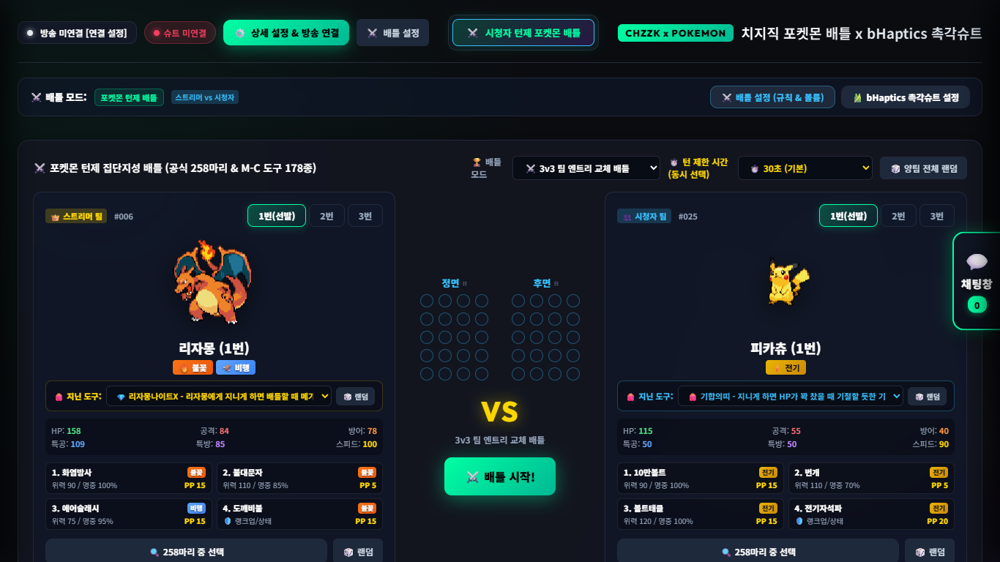
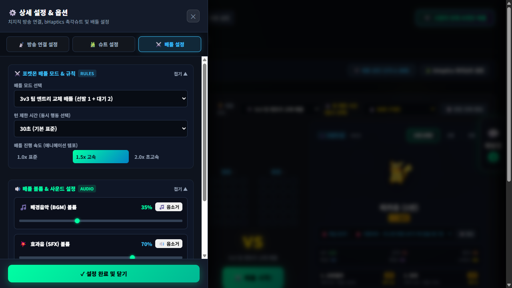
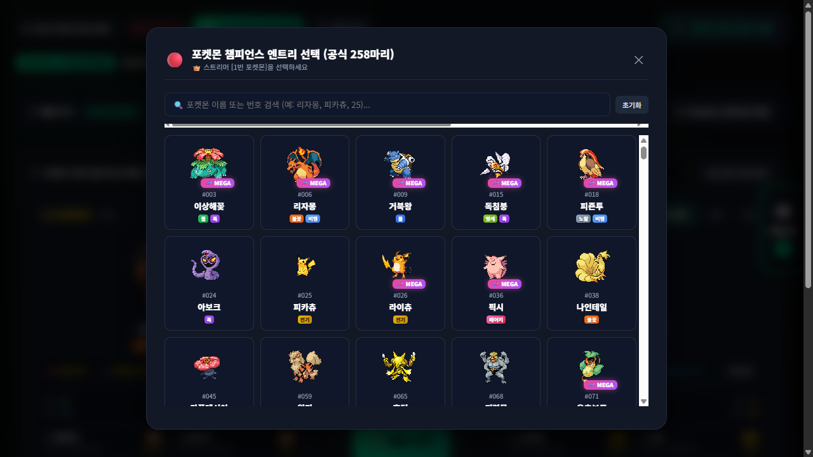

# ⚡ 치지직 x 포켓몬 배틀 x bHaptics 촉각슈트 (CHZZK Pokemon bHaptics)

<div align="center">

[](https://www.python.org/)
[](https://www.bhaptics.com/)
[](https://chzzk.naver.com/)
[](LICENSE)
[](https://github.com/ManofKimchi08/chzzk-pokemon-bhaptics/releases)

<br/>

**네이버 치지직(CHZZK) 라이브 방송과 연동하여 시청자들과 실시간 턴제 포켓몬 대결을 펼치고,<br/>스트리머의 포켓몬이 피격당할 때마다 bHaptics 촉각슈트(TactSuit)에 실시간 충격과 진동을 전달하는 인터랙티브 스트리밍 시스템입니다.**

</div>

---

## 📸 스크린샷 (Screenshots)

### 1. 메인 배틀 아레나 (Main Battle Arena)
실시간 HP 바, 상태이상, 타입 상성, 4종 기술 및 지닌 물건(메가스톤 포함), 실시간 2D 촉각 모터 뷰어 제공


### 2. 배틀 설정 및 사운드 볼륨 제어 (Battle & Audio Settings Drawer)
3v3 팀 엔트리 교체 / 1v1 단판 모드, 턴 제한 시간(15~60초/무제한), 배틀 애니메이션 배속(1.0x / 1.5x / 2.0x), BGM / 효과음 독립 볼륨 조절 및 음소거


### 3. 챔피언스 공식 258마리 도감 선택 (Pokedex Selection Modal)
세대별·타입별 필터링, 검색, 메가진화 표식 및 능력치 확인을 지원하는 엔트리 피커


### 4. OBS 스튜디오 브라우저 오버레이 (Haptic Motor Overlay for OBS)
방송 화면에 전면/후면 촉각 슈트의 실시간 점등을 투명 배경으로 송출할 수 있는 독립 브라우저 소스


---

## ✨ 핵심 기능 (Core Features)

### 1. 📡 치지직(CHZZK) 라이브 방송 채팅 완벽 연동
- 스트리머 닉네임 검색 또는 채널 ID(32자) / 방송 URL 입력으로 즉시 연결
- 19세 연령제한 방송을 위한 네이버 쿠키(`NID_AUT`, `NID_SES`) 안전 입력 지원
- 시청자 채팅창 집단지성 투표: `!1`, `!2`, `!3`, `!4` 또는 `!화염방사` 등으로 기술 투표 및 최다 득표 기술 자동 시전

### 2. 🎽 bHaptics TactSuit X40 / X16 촉각슈트 풀 피드백
- **공식 bhaptics-python SDK 및 로컬 WebSocket Player(포트 15881 / 15888) 듀얼 지원**
- **데미지 비율(%) 비례 5단계 피격 진동 패턴**:
  - **경타 (Light, 1~20%)**: 가슴 중앙 집중 1회 타격
  - **중타 (Medium, 21~50%)**: 명치 및 복부 2연속 타격
  - **강타 (Heavy, 51~80%)**: 전면 전체 + 등 부위 3연속 버스트
  - **치명타 (Critical, 81~100%)**: 40개 전신 모터 100% 풀파워 4연속 충격
  - **기절 (Faint)**: 전신 강력 펄스 후 감쇄 진동
- **위기 심장박동 (Heartbeat)**: 스트리머 체력이 20% 이하(빨간 피)일 때 좌측 가슴에 긴박한 심장 박동 펄스 지속 전달
- **전면/후면 게인 튜닝 & 마스터 볼륨**: 사용자 체형과 슈트 모델에 맞춰 진동 세기 미세 조정 가능

### 3. ⚔️ 포켓몬 챔피언스 정통 턴제 배틀 시스템
- **1~3세대 258마리 완전 수록**: 실시간 고화질 도트 스프라이트, 뒷모습 스프라이트, 타입 상성(18개 타입) 완전 구현
- **지닌 물건(178종) & 메가진화**: 리자몽나이트, 팬텀나이트 등 메가진화 폼체인지 및 특성/종족값 상승
- **3v3 팀 엔트리 교체 배틀 & 1v1 단판 승부**: 자유로운 선발 및 대기 포켓몬 교체 기능

### 4. 🎵 다이내믹 사운드 & BGM 엔진
- **배틀 상황별 자동 BGM 전환**:
  - 기본 트레이너 배틀 BGM
  - 1마리 생존 및 빨간 피(위기 상태) 진입 시 긴박한 **위기 전용 BGM** 자동 크로스페이드
  - 경기 종료 시 스트리머/시청자 승패에 맞춘 **승리 팡파레 BGM** 자동 재생
- 18개 타입별 고유 피격 효과음 및 급소/빗나감 사운드

### 5. 🎛️ OBS Studio 방송 최적화
- 헤더의 **[OBS 오버레이 복사]** 버튼을 통해 `http://localhost:8000/overlay/haptic` 브라우저 소스 링크 복사 가능
- OBS에서 너비 400, 높이 300으로 추가 시 투명 배경에 네온 촉각 모터 뷰어가 방송 화면에 깔끔하게 출력

---

## 🚀 시작하기 (Getting Started)

### 방법 A: 무설치 원클릭 실행 파일 (권장)
1. [Releases](https://github.com/ManofKimchi08/chzzk-pokemon-bhaptics/releases) 탭에서 최신 버전의 `치지직_포켓몬_bHaptics.exe`를 다운로드합니다.
2. 다운로드한 파일을 더블 클릭하여 실행하면 브라우저(`http://localhost:8000`)가 자동으로 열립니다.

### 방법 B: Python 소스코드 직접 실행
```bash
# 1. 레포지토리 클론
git clone https://github.com/ManofKimchi08/chzzk-pokemon-bhaptics.git
cd chzzk-pokemon-bhaptics

# 2. 필수 라이브러리 설치
pip install -r requirements.txt

# 3. 서버 실행 (자동 브라우저 오픈)
python server.py
# 또는 run.bat 더블 클릭
```

---

## 💬 방송 채팅 명령어 안내 (Viewer Commands)

시청자들은 별도 설치 없이 치지직 방송 채팅창에 아래 명령어를 입력하여 실시간 배틀에 참여할 수 있습니다:

| 명령어 | 설명 | 예시 |
|---|---|---|
| `!1` ~ `!4` | 해당 번호의 기술에 투표 | `!1` |
| `![기술명]` | 기술 이름을 직접 입력하여 투표 | `!10만볼트`, `!지진` |
| `!교체 [1~3]` | 대기 포켓몬으로 교체 투표 (3v3 모드) | `!교체 2` |
| `!포켓몬 [이름/번호]` | 시청자 팀 엔트리 포켓몬 추천 | `!포켓몬 피카츄`, `!포켓몬 6` |

---

## 🛠️ 기술 스택 (Tech Stack)

- **Backend / Core**: Python 3.10+, `http.server`, `websockets`, `bhaptics-python`, `numpy`
- **Frontend / UI**: HTML5 Canvas, Modern CSS3 Glassmorphism, Vanilla ES6+ JavaScript
- **Audio Engine**: Web Audio API (Multi-bus GainNodes for BGM/SFX, dynamic crossfading)
- **Haptic Hardware**: bHaptics TactSuit X40, TactSuit X16, Tactosy, Tactal
- **Streaming Platform**: Naver CHZZK (Chzzk Unofficial Open Chat Protocol)

---

## 📄 라이선스 (License)

This project is licensed under the [MIT License](LICENSE).
Pokemon is a trademark of Nintendo, Creatures Inc., and GAME FREAK inc.
